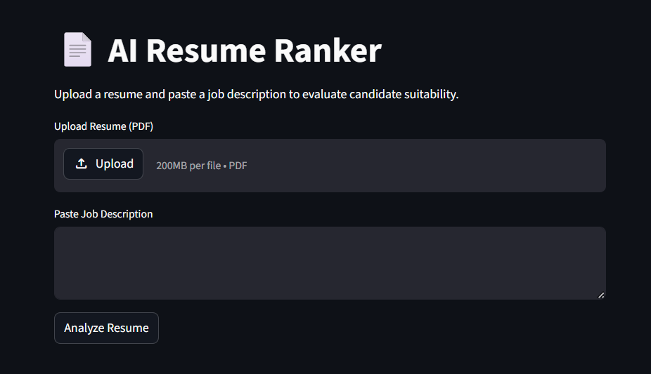
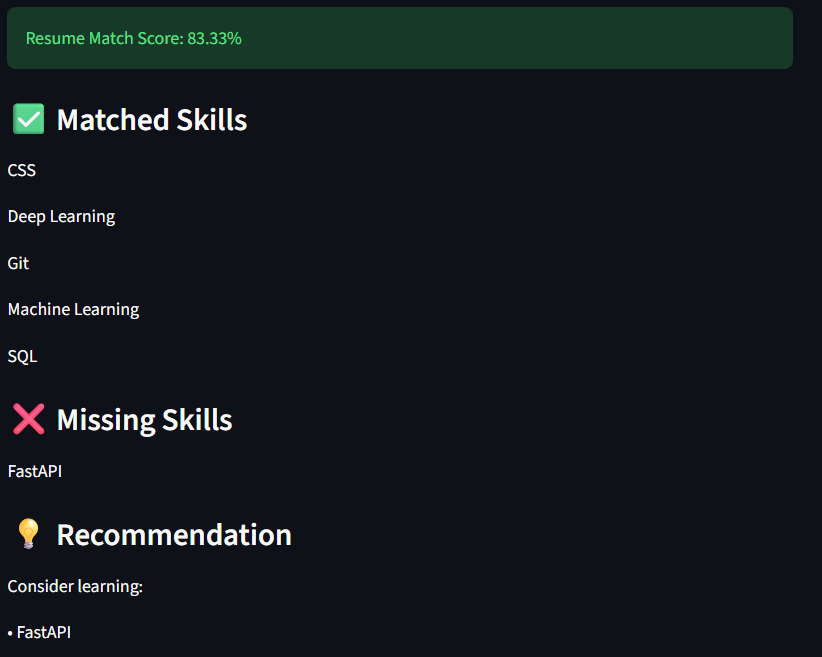

# 📄 AI Resume Ranker

An ATS-style Resume Ranking System that analyzes resumes against job descriptions using NLP techniques, PDF parsing, and skill matching.

The application extracts technical skills from a resume PDF, compares them with the required skills in a job description, and generates a resume match score along with skill-gap recommendations.

---

## 🚀 Features

- Upload Resume PDF
- Automatic Resume Parsing
- Technical Skill Extraction
- Job Description Skill Analysis
- Resume Match Score Calculation
- Missing Skill Detection
- Skill Recommendations
- Dynamic Skill Library using `skills.txt`

---

## 🛠️ Technologies Used

- Python
- Streamlit
- PyPDF2
- Regular Expressions (Regex)
- NLP Concepts
- Skill Matching Engine

---

## 📊 Project Workflow

```text
Resume PDF
      ↓
PDF Text Extraction
      ↓
Text Cleaning
      ↓
Skill Extraction
      ↓
Job Description Analysis
      ↓
Skill Matching
      ↓
Resume Match Score
      ↓
Recommendations
```

## 📂 Project Structure

```text
AI-Resume-Ranker/
│
├── app.py
├── skills.txt
├── resume_ranker.ipynb
├── Requirements.txt
├── dummy_resume.pdf
├── README.md
├── User_Interface1.png
└── User_Interface2.png
```

---


## 📸 Application Preview

### Home Page


### Resume Analysis Report


## ✅ Example Output

```text
Resume Match Score: 88.89%

Matched Skills:
✅ Python
✅ Machine Learning
✅ Deep Learning
✅ TensorFlow
✅ AWS
✅ Git
✅ Generative AI

Missing Skills:
❌ Docker

Recommendation:
Learn Docker to improve suitability for this role.
```

---

## 🎯 Key Learnings

- PDF Parsing using PyPDF2
- NLP-based Skill Extraction
- Dynamic Skill Libraries
- Job Description Analysis
- Resume Ranking Logic
- Streamlit Application Development

---

## 🔮 Future Improvements

- Multiple Resume Ranking
- Candidate Comparison Dashboard
- ATS Compatibility Score
- Semantic Skill Matching
- Recruiter Analytics Dashboard
- Resume Improvement Suggestions

---

## ⚙️ Installation

### Clone the Repository

```bash
git clone https://github.com/Adarsh0333/AI-Resume-Ranker.git
```

### Install Dependencies

```bash
pip install -r requirements.txt
```

### Run the Application

```bash
streamlit run app.py
```

---

## 👨‍💻 Author

**Adarsh Mani Tiwari**

- GitHub: https://github.com/Adarsh0333
- LinkedIn: https://linkedin.com/in/adarsh-mani-tiwari-a16b34325

Aspiring AI/ML Engineer 🚀
